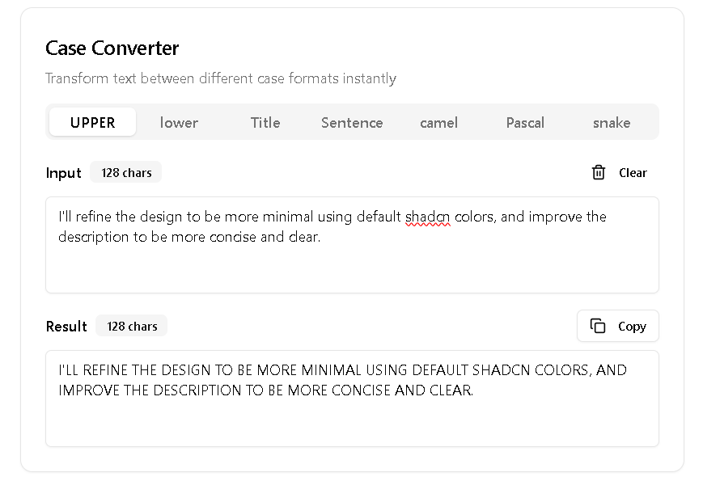

# Uppercase/Lowercase Tool

**Convert text to ALL CAPS, lowercase, Title Case, etc.**

A lightweight web app built with [Next.js](https://nextjs.org/), [shadcn/ui](https://ui.shadcn.com/), and [Tailwind CSS](https://tailwindcss.com/). Perfect for quickly converting text to different cases.



## ✨ Features

-   🔡 Convert text to uppercase
-   Convert text to lowercase
-   Convert text to Title Case
-   Convert text to Sentence case
-   Convert text to camelCase
-   Convert text to PascalCase
-   Convert text to snake_case
-   🧰 Simple, clean interface built with `shadcn/ui` components
-   🎨 Easily customizable with Tailwind CSS

## 🧱 Tech Stack

-   **Next.js** – App router, fast builds, SSR
-   **Tailwind CSS** – Utility-first CSS framework
-   **shadcn/ui** – Beautiful, accessible UI components

## 🚀 Getting Started

### 1. Clone the repository

```bash
git clone https://github.com/azkriven16/case-converter.git
cd case-converter

npm install

npm run dev
```

## Open http://localhost:3000 in your browser
